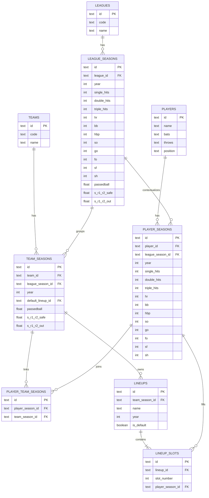

# Sit-Val ERD

## Notes

* `team_seasons -> lineups -> lineup_slots -> player_seasons` is the lineup calculation path.
* `player_team_seasons` allows one player season to belong to multiple teams in the same year.
* Runner values are stored directly on `league_seasons` and optionally overridden on `team_seasons`.
* Fallback for lineup calculation is:
  * `team_seasons.runner_*`
  * `league_seasons.runner_*`
  * app default constants
